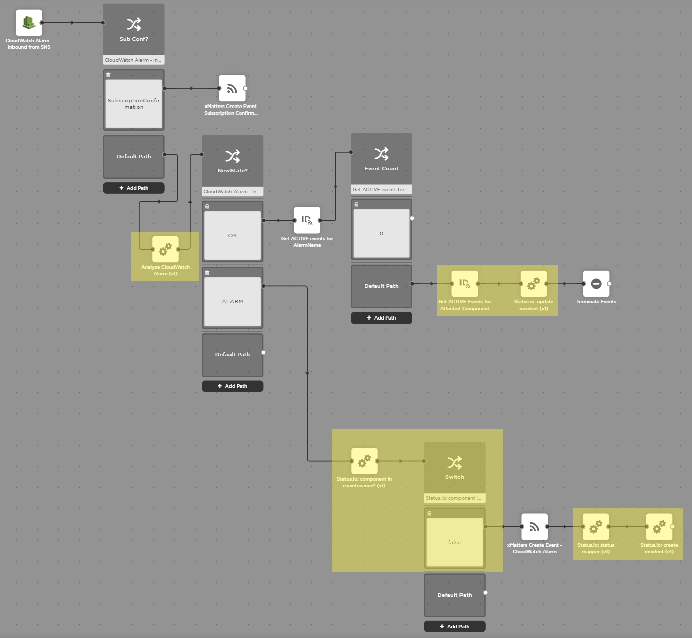

# Status.io Outbound (from xMatters) Integration
With this Outbound Integration, components on Status.io affected by one or more xMatters events have incidents created for them unless they are in an active maintenance window. When the last xMatters event affecting a component has been terminated, the incident for the component is updated to show that the component is now healthy again but being monitored.

<kbd>
  <a href="https://support.xmatters.com/hc/en-us/community/topics"></a>
</kbd>

# Pre-Requisites
* [Status.io](https://status.io) account.
* xMatters account - If you don't have one, [get one](https://www.xmatters.com)!

# Files
* [StatusioIntegration.zip](StatusioIntegration.zip) - This is an example workflow. Note that it does not include any inbound integration to trigger the creation of an xMatters event.

# How it works
This integration is intended to be added to an existing workflow that is triggered when there is a problem and when that problem has been resolved, e.g. the AWS CloudWatch Integration.

The logic of the workflow is expected to follow something like the following:

1. Inbound trigger fires, providing the following information:
- the component that is affected by the trigger
- the severity of the problem
- (optional) a description of the problem for internal consumption (e.g. a Jira ticket for IT Support)

2. If the trigger indicates an alarm status, the first step used is `Status.io component in maintenance?` in order to decide whether or not an incident should be created.

3. If the output from that step is `false`, a xMatters event is created, followed by `Status.io: status mapper` and `Status.io: create incident`.

4. If the trigger indicates a non-alarm status, the workflow runs a `Get x Events for y` xMatters step followed by `Status.io: update incdent`. The workflow should only attempt to terminate the underlying xMatters event as the final step. This will be explained in more detail below.

The following image shows an example complete workflow that started from the CloudWatch Integration. The boxes marked in yellow have been added to incorporate the Status.io integration.

<kbd>
  
</kbd>

# Installation
## Get Status.io API values
1. Go to https://status.io and log in.
2. Click on `API` on the left-hand navbar.
3. Make a note of your Status Page ID.
4. Click on `Display API Credentials`.
5. Make a note of your API ID and API Key.

## xMatters initial set up
1. Log in to your xMatters instance.
2. Import the `StatusioIntegration.zip` file.
3. In the workflow where you want to use this integration, click on the `Integration Builder` tab.
4. Click on `Edit Constants`.
5. Click on `Add Constant`. Set the name to `Status.io Page ID` and set the value to the Status Page ID previously noted. Click on `Save Changes`.
6. Click on `Add Constant`. Set the name to `Status.io API ID` and set the value to the API ID previously noted. Click on `Save Changes`.
7. Click on `Add Constant`. Set the name to `Status.io API Key` and set the value to the API Key previously noted. Click on `Save Changes`.
8. Click on `Edit Endpoints`.
9. If there isn't already an endpoint called `Status.io`, follow these steps:
  * Click on `Add Endpoint`.
  * Set the name to `Status.io`.
  * Set the base URL to `https://api.status.io`.
  * Set the authentication type to `None`.
  * Click on `Save Changes`.

## Adding the integration
To add the integration to your workflow, follow these steps:


## Application ABC set up
Any specific steps for setting up the target application? The more precise you can be, the better!

Images are encouraged. Adding them is as easy as:
```
<kbd>
  
</kbd>
```

<kbd>
  
</kbd>


# Testing
Be specific. What should happen to make sure this code works? What would a user expect to see? 

# Troubleshooting
Optional section for how to troubleshoot. Especially anything in the source application that an xMatters developer might not know about, or specific areas in xMatters to look for details - like the Activity Stream? 
